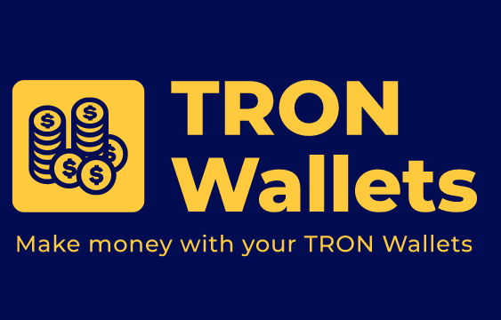

# Example TRON Wallets

This is a simple app for download data about your example TRON Wallets. This simple app was one of my recruitment tasks that I passed through successfully.

### Create React App

This project was bootstrapped with [Create React App](https://github.com/facebook/create-react-app).

# Live Demo

https://mateusz24polok.github.io/Example-TRON-Wallets

# Instructions how to use

1. Put your TRON wallets addresses into start form. You can dynamicly add and remove input field.
2. Click "Download TRONs Table" and if you put your wallets correctly you should see table of your wallets.
3. Now You can dynamicly sort or filter your wallets.

 

## Example TRON Wallets to use (base58 format):

- TGmcz6UMqeTUoNryw4LcPeTWmo1DWrxRUK
- TSFKJsiJrt6bUTmxS1F1Fmv6UUYdGVB9Ws
- TN1nWMYqhnqrBXPMH1ECYouVaafRkYxhNb
- TCFQhzJgXJnn56sqJV38H8c5YAwELZugvz
- TUv34RrPNY2qTNHZ9q4mLc9AuUu9Tpy3Jg

 

# Technologies

## Technologies used in project:

 

HTML

CSS

JavaScript ES6+

React.js with create-react-app

Redux with react-redux

 

Redux Saga

 React Router

Styled Components

 Fetch API

 

# Author and contact

- author: Mateusz Polok
- email: mateusz24polok@gmail.com
- phone: +48535731868

 

# Available Scripts

In the project directory, you can run:

### `npm start`

Runs the app in the development mode.\
Open [http://localhost:3000](http://localhost:3000) to view it in the browser.

The page will reload if you make edits.\
You will also see any lint errors in the console.

### `npm test`

Launches the test runner in the interactive watch mode.\
See the section about [running tests](https://facebook.github.io/create-react-app/docs/running-tests) for more information.

### `npm run build`

Builds the app for production to the `build` folder.\
It correctly bundles React in production mode and optimizes the build for the best performance.

The build is minified and the filenames include the hashes.\
Your app is ready to be deployed!

See the section about [deployment](https://facebook.github.io/create-react-app/docs/deployment) for more information.

### `npm run eject`

**Note: this is a one-way operation. Once you `eject`, you can’t go back!**

If you aren’t satisfied with the build tool and configuration choices, you can `eject` at any time. This command will remove the single build dependency from your project.

Instead, it will copy all the configuration files and the transitive dependencies (webpack, Babel, ESLint, etc) right into your project so you have full control over them. All of the commands except `eject` will still work, but they will point to the copied scripts so you can tweak them. At this point you’re on your own.

You don’t have to ever use `eject`. The curated feature set is suitable for small and middle deployments, and you shouldn’t feel obligated to use this feature. However we understand that this tool wouldn’t be useful if you couldn’t customize it when you are ready for it.
